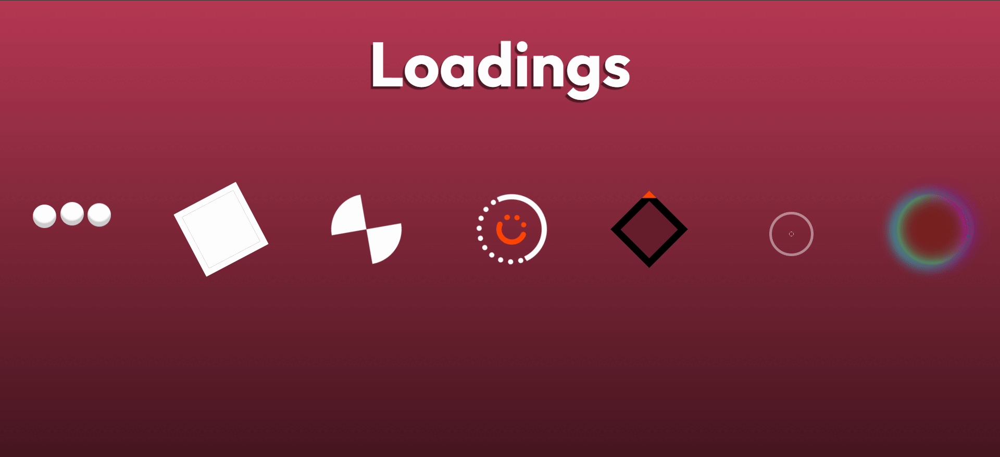

# 🎨 CSS Loadings & Animações

Bem-vindo ao meu projeto de **animações e loadings feitos 100% em CSS puro.** 💻🎉

Aqui você vai encontrar efeitos visuais leves e criativos para usar em sites e projetos. Tudo simples, sem frameworks nem bibliotecas externas.

---

## 📸 Preview



---

## 🚀 Visualização

Confira o site funcionando aqui:
👉 [https://Keetta.github.io/css-loadings/](https://Keetta.github.io/css-loadings/)

---

## 🛠 Tecnologias usadas

- 🖼️ HTML5
- 🎨 CSS3 (animações e transições)
- ⚡ JavaScript (para interatividade leve)

---

## 📚 Como usar

1. Clone este repositório:
   ```bash
   git clone https://github.com/Keetta/css-loadings.git
